# PictureManager
## B/S大程设计 - 图片管理系统
本次实验的目的是设计一个包括用户注册登录、图片上传、图片浏览、图片删除等功能的图片管理系统。  
系统采用B/S架构，前端使用HTML、CSS和JavaScript，后端使用Java语言开发，数据库使用MySQL。

### 项目部署
1. 启动MySQL容器
```angular2html
# 在项目根目录执行：
docker-compose up mysql -d

# 检查是否运行成功
docker-compose ps

# 执行SQL脚本初始化数据库
docker exec -it pic-manager-db mysql -uroot -proot

```
2. 编译项目
后端：
```angular2html
# 进入backend目录
cd backend

# 清理并编译项目
mvn clean compile

# 或者下载依赖
mvn spring-boot:run
```

前端：
```angular2html
# 进入frontend目录
cd frontend

# 如果是第一次，请安装依赖
npm install

# 启动前端开发服务器
npm run dev
```

3. 数据库唤起
```angular2html
# 登录 MySQL
mysql -h 127.0.0.1 -P 3307 -u root -p picture_manager

# 输入密码root后，查看数据库
show databases;

# 切换到 picture_manager 数据库
use picture_manager;
show tables;

# 查看 user 表结构
desc user;

# 退出数据库
quit / exit
```

### 页面布局与功能总览
1. **登录和注册界面**
- 登录：使用用户名或者邮箱登录，验证用户名与邮箱是否存在；输入密码验证用户名或者邮箱与输入的密码是否匹配。
- 注册：填写用户名与邮箱并设置密码，也可以设置自己在网站上的显示名字。用户名会校验唯一性，邮箱会校验唯一性和正确格式。    
**登录界面：**
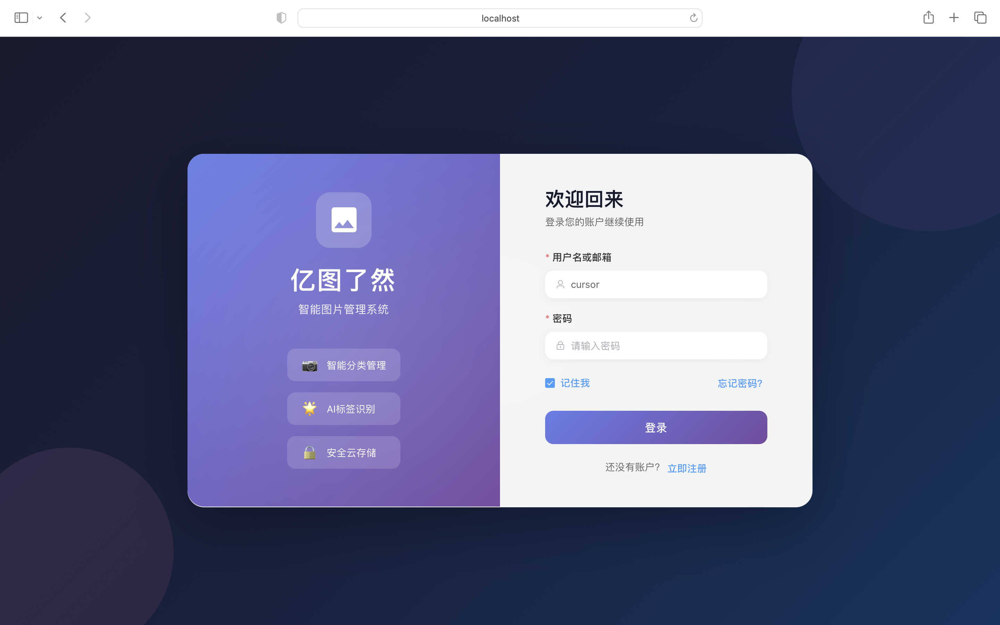
**注册界面：**
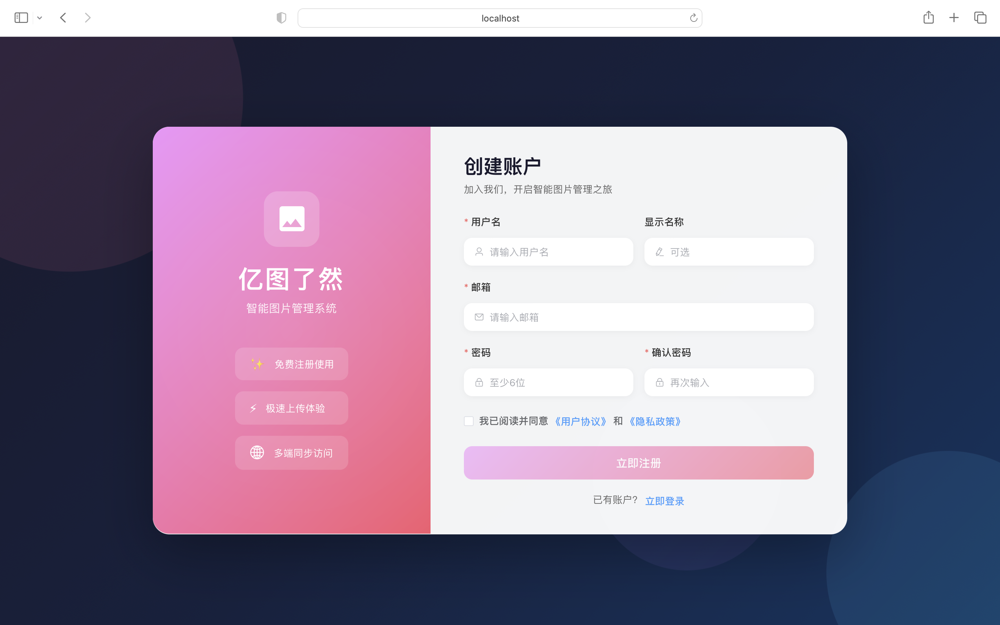
2. **图片库界面**
- 轮播区域：每五秒更换一次图片，最多支持10张图片进行轮播，上传的图片自动加入轮播列表，删除的图片会自动从轮播列表中移除，更新的图片也会显示在轮播列表。
- 标签库：显示所有的标签。
- 图库：显示所有图片，可以支持排序和搜索功能。排序功能包括按照上传时间、文件大小和图片名称排序，可以选择升序或者降序。搜索功能包括按照标题、描述或者选择标签进行筛选。
- 上传图片按钮或者"+"号：点击后弹出上传图片的弹窗，可以支持拖拽或者选择图片进行上传，可以设定标题、描述、标签等基础信息。
- 图库中的图片上鼠标悬浮：显示删除按钮和编辑按钮。这里的编辑只是基础信息，也就是标题、描述、标签的编辑，详细信息与编辑页面是图片详情页面。      
**轮播区域与标签库：**
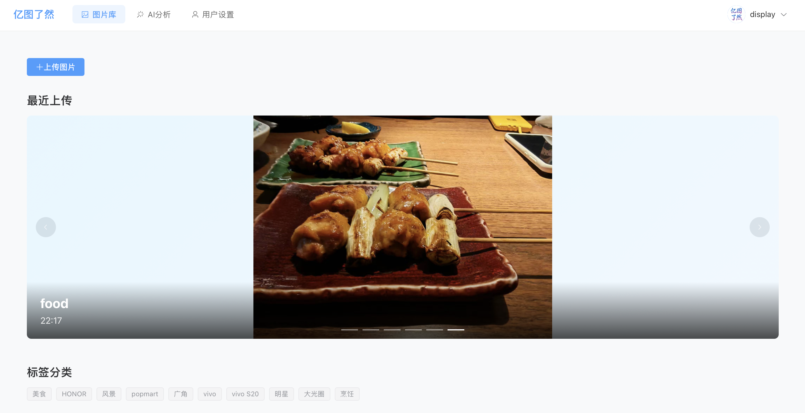
**图库与筛选：**
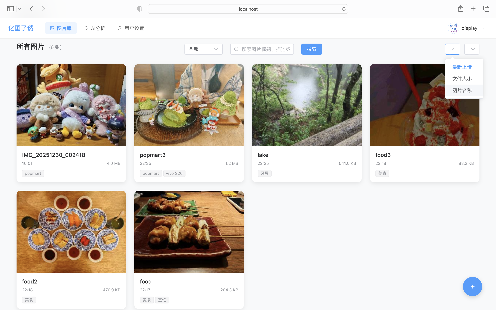
**上传文件：**
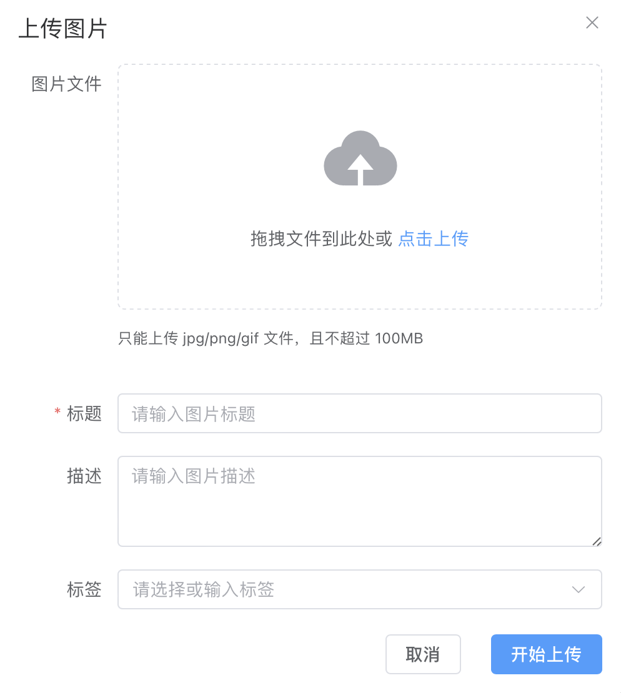
3. **图片详情界面：**
- 详细信息：
    - 基础信息：标题、描述、标签
    - EXIF信息：分辨率、拍摄时间、拍摄设备等信息，有些图片可能没有EXIF信息
    - 文件信息：文件名、文件大小和上传时间
    - 操作按钮：   
    （1）点击“从EXIF生成标签”会直接进入编辑模式。   
    （2）下载原图按钮：点击可以下载原图。    
    （3）删除图片：点击会删除图片，在轮播区域和图库中都不会存在。     
**详细信息：**
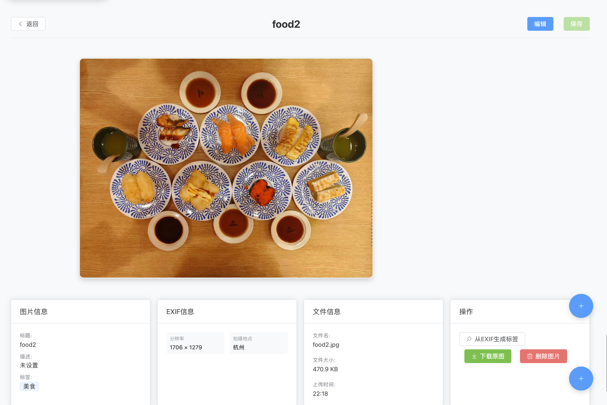
- 编辑功能：
    - 色调修改：包括亮度、对比度和饱和度的修改，不满意可以点击重置滤镜重新编辑。
    - 裁剪功能：输入从左开始保留多少，从上开始保留多少，图片的大小在裁剪框最下方标识了。如果输入的是负数则代表从右开始保留多少和从下开始保留多少。不满意可以点击重置裁剪取消操作。
    - 基础信息更改：标题、描述、标签的更改。
    - EXIF标签自动添加：点击“从EXIF生成标签”会自动将EXIF标签生成到标签中，可以点击叉，删除不想要的标签。         
**图片编辑：**
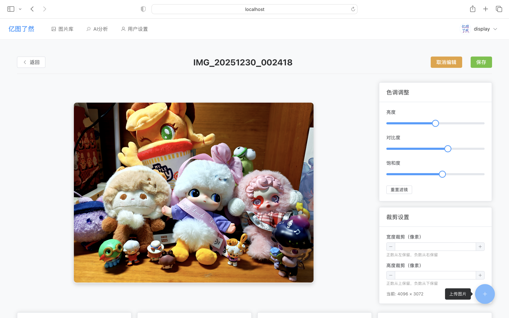
4. **AI拓展分析页面：**
- 功能说明页面：说明这一部分的功能是什么，调用的AI是什么等信息。AI拓展分析页面的主要功能包括图片识别、自动标签生成（这两个功能体现在图片分析页面），AI对话检索和智能分类（这两个功能主要体现在AI对话检索）。    
**功能说明页面：**
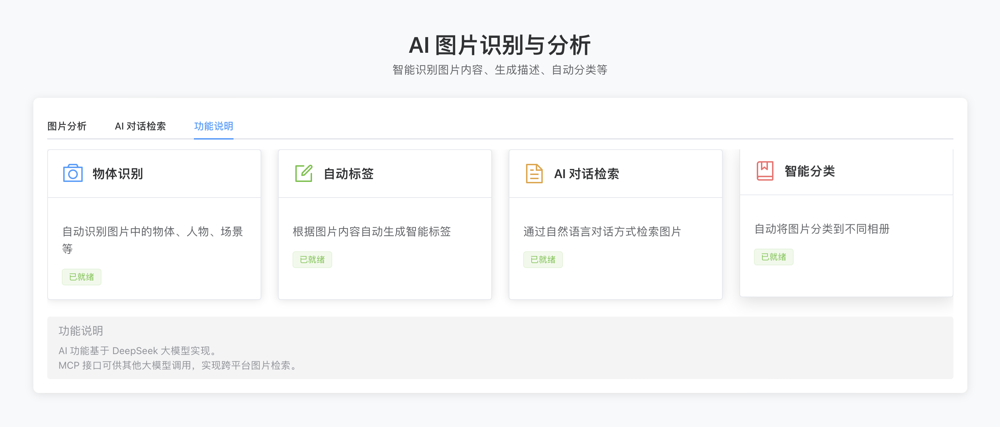
- 图片分析页面：首先选择要分析的图片（如果与图片库的图片还没有一致可以点击刷新图片列表手动同步）。随后点击开始分析等待AI分析结果。最后的结果包括描述、分类、已有标签和建议标签等。可以直接点击建议标签进行添加。     
**图片分析界面：**
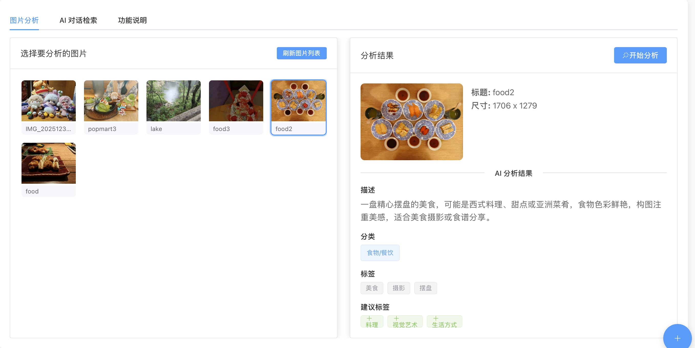
- AI对话检索页面：直接询问AI关于网站上春初的数据的问题，AI可以非常高效且准确的给出想要的答案。     
**AI对话检索页面：**
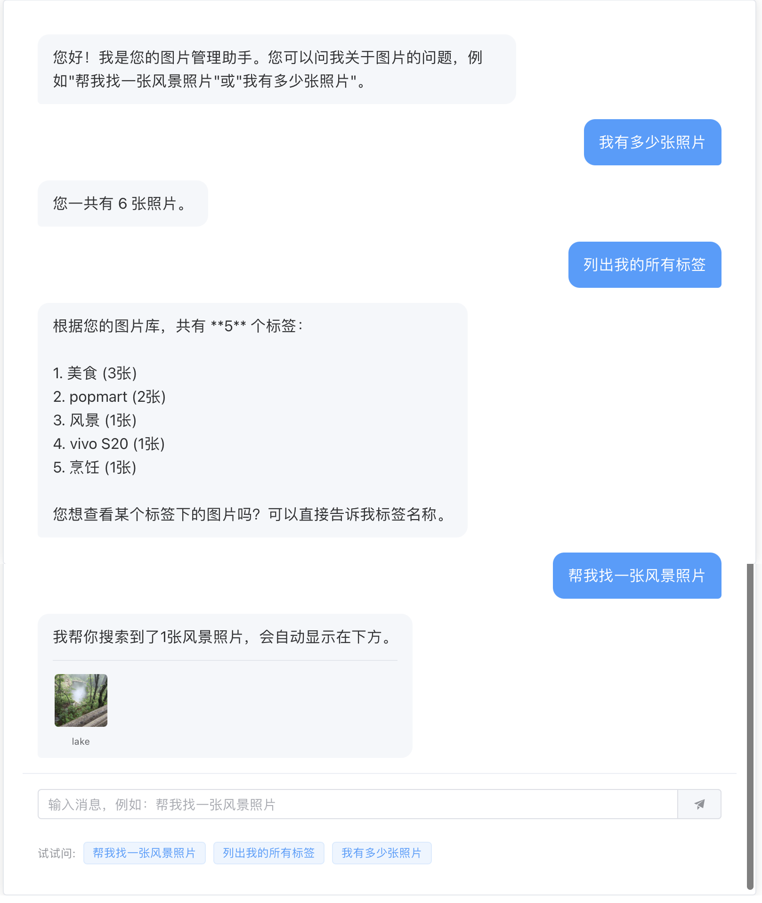
5. **用户设置界面：**
用户设置界面会给出个人信息和账号信息的相关内容，如用户名、注册邮箱、图片数、标签数等信息。用户还能够在这一季诶慢修改自己的显示名称和密码。
- 个人信息界面：用户可以更改自己的显示名称，并且这一更改会被保存到数据库进行持久化存储。     
**个人信息：**
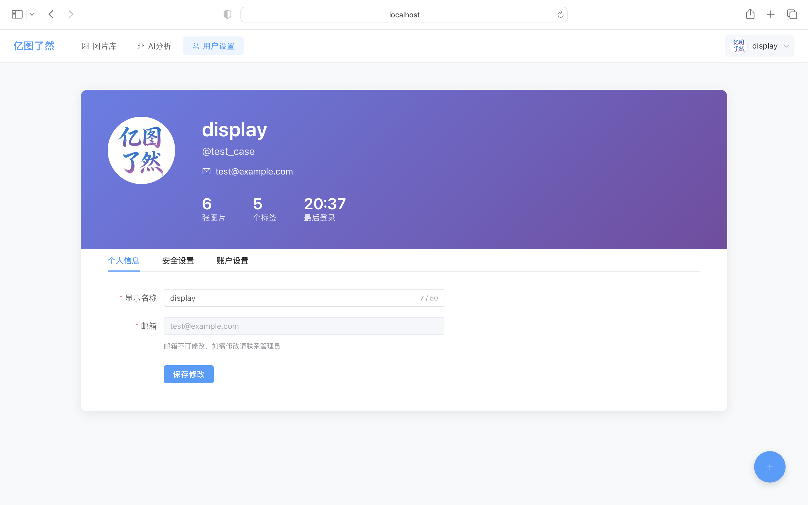
- 安全设置界面：用户通过输入当前密码验证正确可以修改密码，同时，这个页面还会显示登录设备信息和时间，防止陌生设备任意登录。    
**安全设置：**
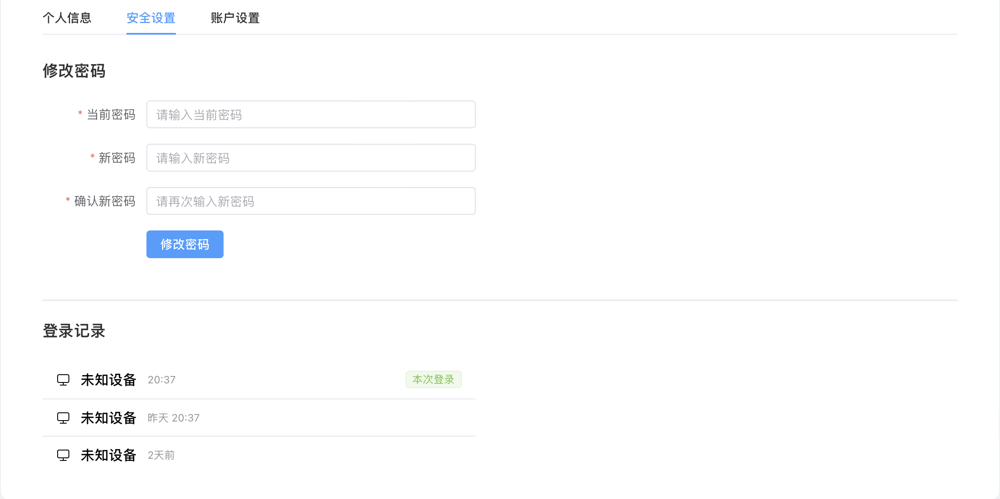
- 账户信息：这个界面显示了用户的存储空间和用量、活跃度以及清理缓存和删除账户的按钮。
**账户信息：**
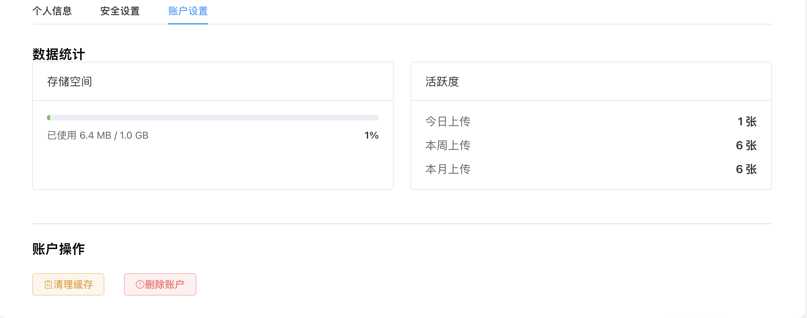
